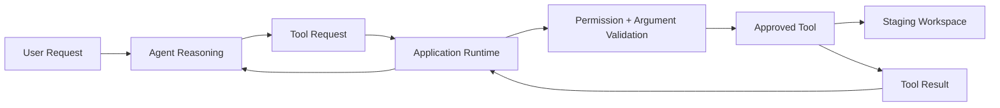
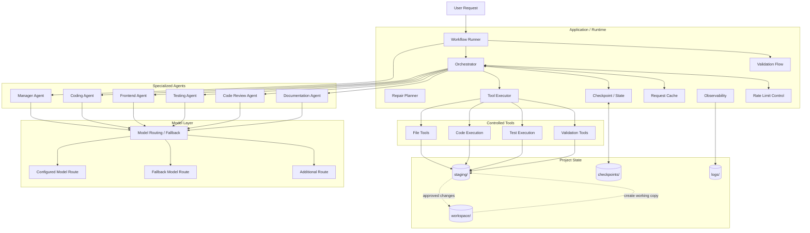
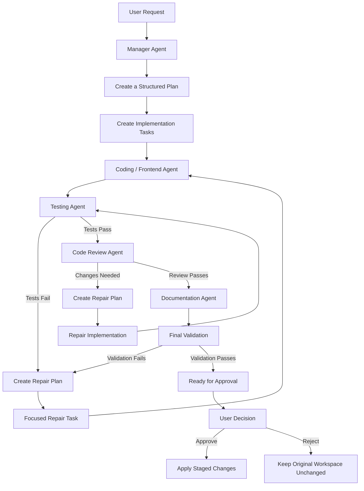
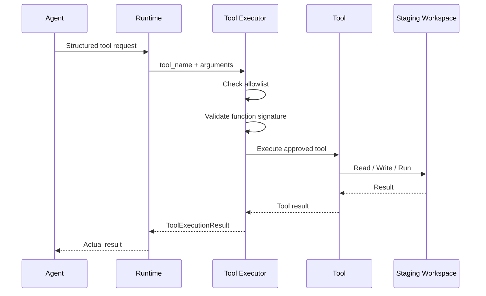
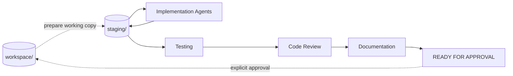
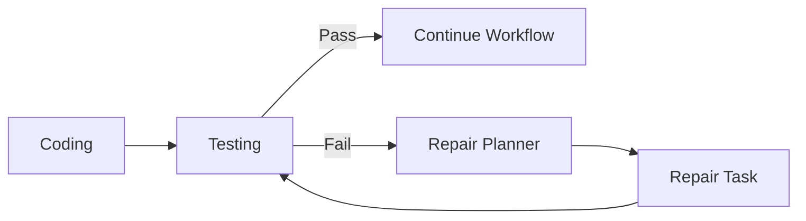
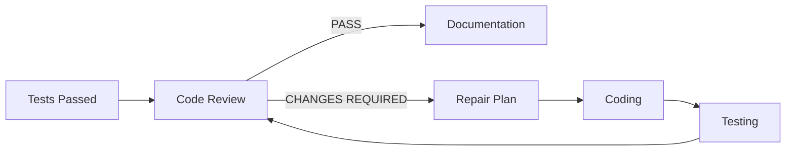
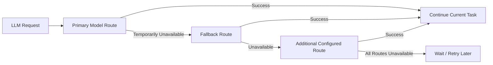
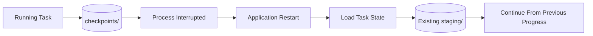
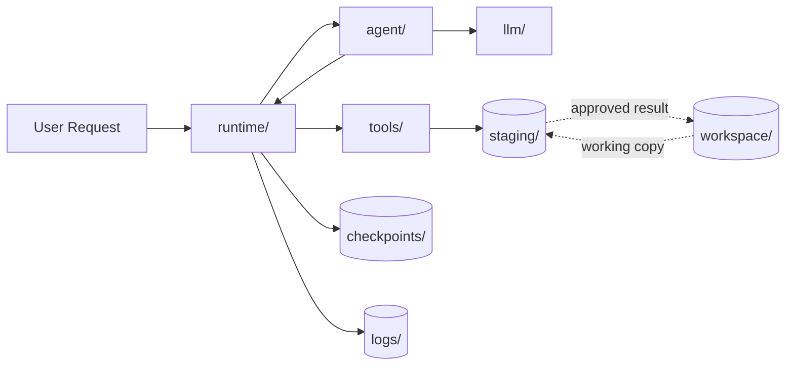

# 🤖 Multi-Agent Software Engineering System

<p align="center">
  <strong>
    A Python multi-agent project I built to explore how specialized agents can plan, implement, test, review, and document software changes while the application keeps control over execution.
  </strong>
</p>

<p align="center">
  
  
  
  
  
  
</p>

---

## Table of Contents

- [Overview](#overview)
- [Why I Built This](#why-i-built-this)
- [What the System Can Do](#what-the-system-can-do)
- [Core Design Philosophy](#core-design-philosophy)
- [High-Level Architecture](#high-level-architecture)
- [End-to-End Workflow](#end-to-end-workflow)
- [Agent Responsibilities](#agent-responsibilities)
- [Runtime vs. LLM Responsibilities](#runtime-vs-llm-responsibilities)
- [Tool Execution Model](#tool-execution-model)
- [Staging Workspace and Safety](#staging-workspace-and-safety)
- [Testing, Repair, and Review Loops](#testing-repair-and-review-loops)
- [Multi-Model Fallback and Resilience](#multi-model-fallback-and-resilience)
- [Checkpointing and Resume](#checkpointing-and-resume)
- [Request Cache](#request-cache)
- [Observability](#observability)
- [Core Data Models](#core-data-models)
- [Project Structure](#project-structure)
- [Installation](#installation)
- [Environment Configuration](#environment-configuration)
- [Model Routing Configuration](#model-routing-configuration)
- [Running the Project](#running-the-project)
- [Example Execution Flow](#example-execution-flow)
- [Current Limitations](#current-limitations)
- [Roadmap](#roadmap)
- [Author](#author)

---

# Overview

This is a Python multi-agent software engineering project that I built to explore how several specialized AI agents can work together on real software-development tasks.

Instead of allowing an LLM to directly modify files or execute commands, I designed the project so that the agents request actions and the application runtime decides how those actions are executed.

The system currently uses different agents for planning, coding, testing, code review, documentation, and frontend-related work.

A user can give the system a software-development request, for example:

> Build a modular Python Todo CLI with JSON persistence, automated tests, code review, and documentation.

From there, the system can plan the work, create implementation tasks, modify the project inside an isolated staging workspace, run tests, repair failures, review the result, generate documentation, and finally prepare the result for approval.

The main idea behind the project is simple:

> **Agents reason and propose actions, while the application controls execution.**

---

# Why I Built This

I originally started this project while learning about LLM tool calling and agent-based systems.

At first, the idea was much simpler: give an LLM a set of tools and let it work on a coding task. As I worked on it, I started running into more interesting problems.

For example:

- What happens if an agent generates incorrect code?
- Who should decide whether a tool is safe to execute?
- How should testing be separated from implementation?
- What happens if a model hits a rate limit in the middle of a task?
- Can the system continue after an interruption instead of starting again?
- How can several agents work on the same project without making the workflow uncontrollable?
- How can I understand what happened during a run when something goes wrong?

These questions gradually changed the project from a simple tool-calling experiment into a larger multi-agent software engineering system.

A big part of the project became designing the software around the agents, not just designing the agents themselves.

---

# What the System Can Do

At the moment, the project can handle most parts of a software-development workflow through separate agents and a runtime-controlled execution layer.

Some parts are already working, while others are still being improved or planned for later versions.

| Capability | Status | Description |
|---|---|---|
| Manager planning | ✅ | Breaks a user request into structured implementation tasks and assigns them to the appropriate agent |
| Coding agent | ✅ | Reads and modifies staged project files, runs code, and works through implementation tasks |
| Testing agent | ✅ | Runs tests independently and reports whether the staged implementation works |
| Code review agent | ✅ | Reviews the implementation for bugs, maintainability, edge cases, and possible improvements |
| Documentation agent | ✅ | Generates documentation based on the implementation produced by the workflow |
| Frontend agent | ✅ | Handles frontend or UI-related tasks when they are needed |
| Staging workspace | ✅ | Keeps agent-generated changes separate from the original project while they are being tested and reviewed |
| Controlled tool execution | ✅ | Agents request tools, while the runtime validates and executes those requests |
| Repair loop | ✅ | Failed tests or validation can create focused repair tasks and send the workflow back to implementation |
| Review-repair loop | ✅ | Review findings can trigger another implementation and validation cycle |
| Checkpointing and resume | ✅ | Saves task progress so interrupted work can continue instead of always starting from the beginning |
| Request caching | ✅ | Reuses suitable model responses when the request and staging state have not changed |
| Rate-limit handling | ✅ | Handles temporary model limits and retries when needed |
| Multi-model fallback | ✅ | Can move between configured model routes when one of them becomes unavailable |
| Structured observability | ✅ | Records agent, task, tool, retry, and execution events so runs can be inspected later |
| Human approval before applying changes | 🚧 In Progress | The workflow is designed to keep final changes in staging until the user decides whether to apply them |
| LLM Gateway | 🗺️ Planned | Move provider routing, authentication, retries, rate limits, and model-level observability behind a dedicated gateway |
| Monitoring dashboard | 🗺️ Planned | Add a visual way to inspect runs, agents, events, retries, latency, and model usage |
| Evaluation benchmark | 🗺️ Planned | Compare different agent workflows and measure reliability, cost, latency, and repair behavior |

---

# Core Design Philosophy

While building this project, one idea became very important to me:

> **The agents can decide what they want to do, but the application should stay in control of what actually happens.**

I did not want an LLM to directly execute arbitrary commands, modify files, or decide by itself what is allowed.

Instead, an agent asks to use a known tool, and the runtime handles the real execution.


In practice, the flow is:

- the agent decides what action it wants to take,
- it requests one of the tools available to it,
- the runtime checks whether that tool is allowed,
- the arguments are validated,
- the tool is executed by application code,
- the real result is returned to the agent,
- the execution can also be logged and inspected later.

This separation became one of the main ideas behind the project.

---

# High-Level Architecture

As the project became larger, I separated it into a few clear parts instead of letting the agents handle everything themselves.

At a high level, the system has five main areas:

- **Application and Runtime** — controls the workflow and execution
- **Agents** — handle reasoning and specialized tasks
- **Model Layer** — connects agents to configured LLM routes
- **Tools** — provide controlled access to files, code execution, and tests
- **Project State** — keeps the original project, staging workspace, checkpoints, and logs separated



---

# End-to-End Workflow

I wanted the workflow to be more structured than simply letting several agents talk to each other until they decide the task is finished.

A request normally moves through a series of stages, and each stage has a specific responsibility.


The process starts with the Manager Agent, which turns the user's request into structured implementation tasks.

Those tasks are then handled by the appropriate implementation agent. After the implementation is produced, a separate Testing Agent checks the staged project.

If something fails, the workflow does not simply stop. A repair task can be created and sent back to implementation.

Once the tests pass, the Code Review Agent looks at the result from a different perspective. It can still request changes even when the tests are successful.

After the implementation passes both testing and review, the Documentation Agent works with the resulting project and the runtime performs final validation.

The final result stays in the staging workspace until it is ready to be accepted or rejected.

The approval/application part of the workflow is still being refined, but the goal is to keep the original workspace unchanged until the user explicitly decides to apply the staged result.

---
# Agent Responsibilities

I separated the workflow into different agents because I did not want one model to handle planning, implementation, testing, review, and documentation all by itself.

Each agent has a smaller and clearer responsibility.

## Manager Agent

The Manager Agent is responsible for understanding the user's request and turning it into a structured plan.

I use it mainly for:

- understanding the overall goal,
- breaking the request into implementation tasks,
- deciding which agent should handle each task,
- creating structured task proposals,
- helping create repair tasks when something fails later in the workflow.

The Manager is not supposed to implement the project itself.

Its job is to decide what needs to be done and how the work should be divided.

A simplified plan can look like this:

```json
{
  "goal_summary": "Create a modular Todo CLI application.",
  "tasks": [
    {
      "description": "Implement the core Todo model, persistence layer, and CLI.",
      "assigned_agent": "coding_agent",
      "complexity": "medium",
      "reason": "The task requires Python implementation and file changes."
    }
  ]
}
```

The Manager should **plan**, not implement.

---

## Coding Agent

The Coding Agent handles most of the general implementation work.

It can inspect the staged project, read files, write or modify code, run Python, execute tests, inspect failures, and continue working on the task when something needs to be fixed.

Typical actions include:

- listing project files,
- reading staged source files,
- creating or modifying files,
- running Python code,
- running staged tests,
- inspecting errors,
- applying fixes.

One thing I did not want was for the Coding Agent to be trusted just because it says that the task is complete.

Its changes still go through testing, review, and validation before the workflow considers the result ready.

---

## Frontend Agent

I added a separate Frontend Agent for tasks that are mainly related to the user interface or presentation layer.

Examples include:

- HTML and CSS,
- UI components,
- frontend-related files,
- presentation and layout changes,
- visual integration work.

The main reason for separating this role was to keep the Coding Agent from becoming responsible for every type of implementation task.

For projects without frontend work, this agent may not be used at all.

---

## Testing Agent

The Testing Agent is separate from the agent that writes the implementation.

I wanted testing to act as another layer of verification instead of letting the same agent write the code and then decide by itself that the code works.

The Testing Agent can:

- inspect the staged project,
- run the project's tests,
- reproduce failures,
- inspect test output,
- report whether the implementation passed or failed.

Its job is mainly to provide evidence about the current implementation.

It does not silently change the production code just to make a failing test disappear.

---

## Code Review Agent

Passing the tests does not always mean that the implementation is good enough.

That is why I added a separate Code Review Agent after testing.

It looks at things such as:

- correctness,
- possible bugs,
- maintainability,
- unnecessary complexity,
- edge cases,
- architecture,
- robustness,
- consistency with the original request,
- quality of the tests.

If the review finds an important problem, the workflow can create another repair task and send the implementation back for changes.

---

## Documentation Agent

The Documentation Agent works near the end of the workflow.

I placed documentation later because I wanted it to describe the implementation that actually exists after coding, testing, and review, rather than documenting an early plan that might change.

It can help generate or improve:

- README files,
- setup instructions,
- usage instructions,
- project structure explanations,
- architecture notes.

The goal is for the documentation to reflect the final staged project as closely as possible.

---

# Runtime vs. LLM Responsibilities

One of the most important decisions I made in this project was to keep reasoning and execution separate.

The agents are useful for understanding tasks, making decisions, planning work, and deciding what actions they want to take.

But I did not want them to have direct control over the execution environment.

So I separated the responsibilities like this:

| LLM / Agent | Application Runtime |
|---|---|
| Understand the task | Enforce permissions |
| Reason about the problem | Execute tools |
| Decide which tool it wants to use | Validate tool arguments |
| Decide which files it wants to inspect | Enforce workspace boundaries |
| Propose code changes | Apply changes through controlled tools |
| Interpret test results | Run the tests |
| Suggest retries or repairs | Control retry behavior |
| Produce plans | Track task state |
| Decide when a task looks complete | Save checkpoints |
| Request model actions | Handle model routing and fallback |
| Generate explanations | Record execution events |

I think of the relationship like this:

```text
Agent
    decides what should happen

Runtime
    decides what is actually allowed to happen
```

The runtime stays responsible for things such as:

```text
execution
permissions
tool validation
state
staging
retries
checkpoints
observability
final application of changes
```

---

# Tool Execution Model

I did not want the agents to call arbitrary functions or execute commands directly.

Instead, each agent works through a controlled set of tools that are exposed by the runtime.

A typical tool request follows this path:



Some of the tools currently used by the project include:

```text
list_files
read_staged_file
write_staged_file
run_staged_python
run_staged_tests
```
The important part is that the agent only requests an action.

The actual execution is handled by application code.

Before a tool runs, the runtime can check things such as:

- whether the agent is allowed to use that tool,
- whether the arguments are valid,
- whether the requested path is inside the allowed workspace,
- whether the action should be logged,
- how the real result should be returned to the agent.

Different agents can also have different tool permissions.

For example, a Coding Agent may be allowed to write files, while a Testing Agent can be limited to reading files and running tests.

I wanted this separation because giving every agent the same unrestricted tool access would make the system much harder to control and debug.

---

# Staging Workspace and Safety

The repository contains two different filesystem roles:

```text
workspace/
    Original / target project

staging/
    Isolated working copy used by agents
```

The normal development loop is therefore:



This separation is one of the most important safety properties of the system.

During an active workflow:

- `workspace/` represents the original target project.
- `staging/` represents the version currently being changed and validated by agents.
- generated changes are written to staging rather than directly to the original project,
- tests execute against the staged implementation,
- repair cycles remain isolated,
- code review evaluates the staged result,
- the original workspace can remain unchanged until the result is approved.

In other words:

```text
workspace
    ↓ prepare/copy
staging
    ↓
Coding
    ↓
Testing
    ↓
Repair if needed
    ↓
Code Review
    ↓
Documentation
    ↓
Final Validation
    ↓
READY_FOR_APPROVAL
    ↓
explicit apply
    ↓
workspace
```

The staging workspace acts as the **working source of truth during active agent execution**.

---

# Testing, Repair, and Review Loops

A major part of the project is the ability to recover from bad implementations.

## Validation loop



## Review loop



This is different from simply asking one model:

> Write the code, test it, review it, and tell me that it is good.

Each stage has a separate responsibility and can challenge the previous stage.

---

# Multi-Model Fallback and Resilience

While testing longer agent workflows, I ran into a practical problem: a software task can still be perfectly valid even when the model provider temporarily fails.

A model request can fail because of things such as:

- rate limits,
- exhausted quotas,
- temporary network problems,
- provider downtime,
- server-side errors.

I did not want one temporary model failure to automatically stop the entire software-development task.

For that reason, I added a fallback layer to the model system.

A simplified flow looks like this:


A model route is basically a combination of:

```text
provider    
+ model
+ API credential
+ endpoint
```

The order in configuration defines the fallback sequence.

What matters to the agent is not which provider is currently being used. The agent continues working through the model layer while the application handles route selection and failures.
## Cooldowns and Retries

I wanted to avoid repeatedly sending requests to a model route that had just failed.

Without a cooldown, the system could keep retrying the same unavailable route:

```text
Route A -> rate limited
Route A -> rate limited
Route A -> rate limited
```

Instead, temporarily unavailable routes can be placed into cooldown and skipped while other configured routes are tried:

```text
Route A -> rate limited -> cooldown
Route B -> try
Route C -> try
```

This reduces unnecessary requests and gives failed routes time to recover.

For recoverable errors, the runtime can also wait and retry instead of immediately stopping the entire workflow.

The main idea is simple:

```text
Model route failed
        ≠
Software task failed
```

At the moment, this behavior is handled by the model and runtime layers.

---

# Checkpointing and Resume

Long-running agent tasks can involve many model requests, tool calls, file changes, and test cycles.

I did not want an interrupted task to always restart from the beginning, so I added checkpointing to preserve execution state while the workflow is running.

Checkpoint data is stored under:

```text
checkpoints/
```

A task state can contain information such as:

```python
TaskExecutionState(
    task_id=...,
    status=...,
    current_iteration=...,
    last_action=...,
    last_tool=...,
    last_tool_result=...,
    completed_steps=...,
    modified_files=...,
    test_status=...,
    retry_count=...,
)
```

Conceptually:



On resume, the agent can be given:

- the last completed iteration,
- the last tool used,
- files modified so far,
- the last known test status,
- retry count,
- the existing staged project state.

This allows execution to continue from previous progress instead of blindly repeating the entire task.

---

# Request Cache

Agent workflows can send similar model requests multiple times, especially during longer runs.
To avoid repeating the same request unnecessarily, I added a request cache to the runtime.
A cached request can depend on information such as:

```text
model
messages
available tools
staging workspace hash
```
The staging state is important because the same prompt should not automatically reuse an old response after the project files have changed.

For example:

```text
Same prompt
+ same tools
+ same staging state
        ↓
cached response may be reused
```

But:

```text
Same prompt
+ changed staging files
        ↓
new model request
```

This helps reduce unnecessary model calls while still keeping the response connected to the current state of the project.

Only responses that are safe to reuse should be cached.

---

# Observability

As the project grew, I realized that seeing only the final result was not enough.

A single run can involve several agents, model requests, tool calls, retries, test failures, repairs, and review cycles. If something goes wrong, I want to be able to understand what actually happened during the workflow.

For that reason, I added structured observability to the runtime.

Execution logs are stored under:

```text
logs/
```

Representative event types include:

```text
agent_started
llm_request
llm_message
tool_requested
tool_started
tool_completed
tool_failed
rate_limited
temporary_model_error
agent_completed
agent_failed
```

A structured event can carry information such as:

```text
agent_id
task_id
sender
receiver
tool_name
success
decision
confidence
retry_count
latency_ms
tokens / cost
conflict_count
final_outcome
```
Not every event needs every field, but using a shared structure makes it easier to follow what happened across the system.

This makes it possible to understand 
**what happened, which agent did it, which tool was called, what failed, what was retried, and what the final outcome was**
 instead of guessing from a single terminal message.

---

# Core Data Models

## `Task`

Represents a unit of work assigned to an agent.

Conceptually:

```python
Task(
    id=...,
    description=...,
    status="pending",
    assigned_agent=...,
    retries=...,
    dependencies=...,
    result=...,
    error=...,
)
```

---

## `AgentResult`

Separates successful agent execution from arbitrary model text.

Conceptually:

```python
AgentResult(
    success=True,
    agent_name="testing_agent",
    task_id="...",
    message="...",
    data={...},
    error=None,
)
```

---

## `ManagerPlan`

The Manager uses structured output instead of an unstructured paragraph.

```python
class ManagerPlan(BaseModel):
    goal_summary: str
    tasks: list[TaskProposal]
    final_notes: str | None = None
```

---

## `TaskProposal`

```python
class TaskProposal(BaseModel):
    description: str
    assigned_agent: AgentName
    complexity: Complexity
    reason: str
```

This makes planning machine-readable and easier for the runtime to validate.

---

## `ToolExecutionResult`

Tool execution has its own result type.

That allows the runtime to distinguish:

```text
"the tool was successfully executed"
```

from:

```text
"the process launched by the tool actually succeeded"
```

This distinction matters particularly for test execution.

---

# Project Structure

The current repository root is organized like this:

```text
Multi_agent/
│
├── main.py
│
├── requirements.txt
│
├── .env
│
│
├── agent/
│   ├── base_agent.py
│   ├── coding_agent.py
│   ├── testing_agent.py
│   ├── code_review_agent.py
│   ├── documentation_agent.py
│   ├── frontend_agent.py
│   ├── llm_tool_agent.py
│   └── manager_agent.py
│
├── app/
│   └── chat.py
│
├── runtime/
│   ├── orchestrator.py
│   ├── workflow_runner.py
│   ├── validation_flow.py
│   ├── repair_planner.py
│   ├── task_factory.py
│   ├── agent_registry.py
│   ├── checkpoint_store.py
│   ├── request_cache.py
│   └── rate_limit_manager.py
│
├── llm/
│   ├── base_model_client.py
│   ├── gemini_model_client.py
│   ├── openai_compatible_model_client.py
│   ├── fallback_model_client.py
│   ├── model_factory.py
│   ├── model_route_loader.py
│   └── error_utils.py
│
├── models/
│   ├── task.py
│   ├── task_execution_state.py
│   ├── agent_result.py
│   ├── manager_plan.py
│   ├── model_response.py
│   ├── tool_execution_result.py
│   ├── process_result.py
│   ├── model_route.py
│   ├── rate_limit_error.py
│   ├── quota_exhausted_error.py
│   ├── workflow_result.py
│   └── transient_model_error.py
│
├── checkpoints/
│
├── config/
│
├── logs/
│
├── core/
│   ├── config.py
│   ├── paths.py
│   ├── tool_executor.py
│   └── tool_registry.py
│
├── tools/
│   ├── execuitio_tool.py
│   ├── file_tool.py
│   ├── test_tool.py
│   └── validation_tool.py
│
├── observability/
│   ├── events.py
│   └── logger.py
│
├── config/
│   └── model_routes.json
│
├── staging/
│   └── ...
│   
└── workspace/
    └── ...
```

## Directory Responsibilities

| Path | Responsibility |
|---|---|
| `agent/` | Contains the specialized agents used by the system, including Manager, Coding, Testing, Review, Documentation, and Frontend agents |
| `app/` | Handles the user-facing application and interaction flow |
| `checkpoints/` | Stores task execution state so interrupted runs can be resumed |
| `config/` | Contains runtime and model-routing configuration |
| `core/` | Contains shared low-level components used across the system |
| `llm/` | Handles model clients, provider integration, routing, and fallback behavior |
| `logs/` | Stores runtime logs and execution information |
| `models/` | Defines structured data models used by agents and the runtime |
| `observability/` | Contains structured events, logging, and monitoring components |
| `runtime/` | Controls workflow orchestration, task execution, validation, retries, repair loops, caching, and rate limiting |
| `staging/` | Isolated working area where agents generate and validate changes before they affect the target project |
| `tools/` | Contains the controlled tools that agents are allowed to use |
| `workspace/` | Local target project used by the system during execution |
| `main.py` | Main application entry point and component setup |
| `requirements.txt` | Lists the Python dependencies required by the project |
| `.env.example` | Example environment configuration for API keys and local settings |
| `.gitignore` | Defines local, secret, and generated files that should not be committed |

## Architectural Boundaries

```text
agent/
    reasoning roles

runtime/
    orchestration + control

llm/
    provider abstraction + fallback

tools/
    approved actions

models/
    structured internal contracts

observability/ + logs/
    execution visibility

checkpoints/
    resumable execution state

workspace/
    protected original project

staging/
    isolated agent working copy

```

A useful mental model for the repository is:



---

# Installation

## 1. Clone the repository

```bash
git clone https://github.com/Mobyiin/multi-agent-software-engineering.git
cd multi-agent-software-engineering
```

## 2. Create a virtual environment

### Windows

```bash
python -m venv .venv
.venv\Scripts\activate
```

### Linux / macOS

```bash
python -m venv .venv
source .venv/bin/activate
```

## 3. Install dependencies

```bash
pip install -r requirements.txt
```

---
# Environment Configuration

The project uses environment variables to keep API keys and other sensitive configuration outside the source code.

Create a `.env` file in the project root and add the API key required by the model provider you want to use.

Example:

```env
YOUR_PROVIDER_API_KEY=your_api_key_here
```

You can define multiple API keys if you want to configure multiple providers or model routes.

```env
PROVIDER_1_API_KEY=your_first_api_key
PROVIDER_2_API_KEY=your_second_api_key
```

API keys are referenced by their environment variable names, so they do not need to be written directly inside the model configuration.

---

# Model Configuration

I keep model configuration separate from the agents so that changing a model does not require changing the agent implementation itself.

Each model route defines things such as:

- the provider type,
- the environment variable that contains the API key,
- the model name,
- and any provider-specific settings.

A basic route can look like this:

```json
{
  "workers": [
    {
      "enabled": true,
      "type": "<provider-type>",
      "label": "<route-name>",
      "api_key_env": "YOUR_PROVIDER_API_KEY",
      "model": "<model-name>"
    }
  ]
}
```

For OpenAI-compatible providers, a custom API endpoint can also be specified:

```json
{
  "workers": [
    {
      "enabled": true,
      "type": "openai_compatible",
      "label": "<route-name>",
      "api_key_env": "YOUR_PROVIDER_API_KEY",
      "base_url": "<provider-api-url>",
      "model": "<model-name>"
    }
  ]
}
```

To use another model or provider, update the configuration with its API key, endpoint if required, and model name.

Because model routing is separated from the agent implementation, agents do not need to be rewritten when the configured model changes.


---

# Running the Project

Start the application:

```bash
python main.py
```

The CLI accepts a multi-line software request.

Finish the request with:

```text
END
```

Example:

```text
Create a small Python command-line todo application.

Requirements:
- Add tasks.
- List tasks.
- Mark tasks as completed.
- Delete tasks.
- Persist tasks in a JSON file.
- Handle invalid input cleanly.
- Add automated pytest tests.
- Keep the implementation modular and maintainable.
- Review the implementation for bugs and maintainability.
- Create a README with setup and usage instructions.

Work only inside the staging workspace.
END
```

---

Another example:

```text
Build a FastAPI chat backend.

Requirements:
- Use FastAPI.
- Add a WebSocket endpoint.
- Separate connection management from business logic.
- Add Pydantic schemas.
- Add pytest tests.
- Keep the implementation modular.
- Review the final implementation.
- Document setup and architecture.

Work only inside staging.
END
```

A request like this can be decomposed into implementation tasks and then move through testing, review, repair, documentation, and final validation.

---

# Example Execution Flow

A simplified runtime log may look like:

```text
[manager_agent] selected model route

[T001][coding_agent] agent_started
[T001][coding_agent] tool_requested -> list_files
[T001][coding_agent] tool_requested -> read_staged_file
[T001][coding_agent] tool_requested -> write_staged_file
[T001][coding_agent] tool_requested -> run_staged_tests
[T001][coding_agent] agent_completed

[T002][testing_agent] agent_started
[T002][testing_agent] tool_requested -> run_staged_tests
[T002][testing_agent] agent_completed

[T003][code_review_agent] agent_started
[T003][code_review_agent] ...
```

Provider fallback can appear like:

```text
[FallbackModelClient] trying gemini-primary
[FallbackModelClient] gemini-primary: rate limited

[FallbackModelClient] trying gemini-secondary
[FallbackModelClient] gemini-secondary: rate limited

[FallbackModelClient] trying openrouter-free
[FallbackModelClient] selected openrouter-free
```

The same logical task then continues using the selected route.


---

# Current Limitations

This project is still evolving.

Current limitations include:

- agent specialization can be made deeper through stronger role-specific output contracts,
- some tasks can still be decomposed too aggressively into small coding tasks,
- generated-project evaluation is not yet benchmarked systematically,
- model capabilities differ across fallback providers,
- model fallback does not guarantee equal tool-calling quality,
- human approval/application UX is still being refined,
- observability currently focuses on structured logs rather than a full dashboard,
- cost/token tracking is not yet complete for every provider,
- shared staging currently limits safe parallel write execution,
- multi-agent orchestration is mostly sequential because software tasks often have dependencies.

These limitations are intentionally documented rather than hidden.

---

# Roadmap

## Phase 1 — Core Runtime ✅

- [x] Tool calling
- [x] Tool allowlisting
- [x] Staging workspace
- [x] Coding agent
- [x] Test execution
- [x] Checkpoint state
- [x] Structured events

## Phase 2 — Multi-Agent Workflow ✅ / 🚧

- [x] Manager Agent
- [x] Coding Agent
- [x] Testing Agent
- [x] Code Review Agent
- [x] Documentation Agent
- [x] Frontend Agent
- [x] Validation loop
- [x] Repair planning
- [x] Review-repair loop
- [ ] Deeper role-specific output contracts

## Phase 3 — Reliability ✅ / 🚧

- [x] Rate-limit handling
- [x] Transient failure handling
- [x] Model fallback
- [x] Route cooldowns
- [x] Request cache
- [x] Checkpoint/resume
- [ ] Circuit breaker / provider health scoring
- [ ] Unified provider capability metadata

## Phase 4 — Human Control 🚧

- [ ] Final approval flow
- [ ] Apply / Reject / Request Changes UX
- [ ] Staged diff summary
- [ ] Explicit audit record for applied changes

## Phase 5 — Observability 🚧

- [x] Structured events
- [x] Agent/task/tool tracing
- [x] Retry visibility
- [ ] Web dashboard
- [ ] Agent timeline
- [ ] Token and cost charts
- [ ] Conflict metrics
- [ ] Run comparison

## Phase 6 — Evaluation 🗺️

- [ ] Create a fixed benchmark of software tasks
- [ ] Measure task success rate
- [ ] Measure test pass rate
- [ ] Measure repair cycles
- [ ] Measure tool-call count
- [ ] Measure latency
- [ ] Measure token usage
- [ ] Compare single-agent and multi-agent execution
- [ ] Compare model-routing strategies

---


The central idea can be summarized as:

> **LLMs propose. The runtime validates. Tools execute. Tests verify. Review challenges. Humans remain in control.**

---

# Author

**Mobin Yaghooti**
GitHub: [@Mobyiin](https://github.com/Mobyiin)

---
